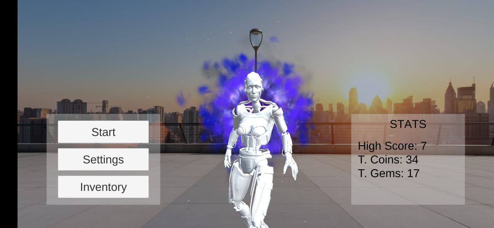
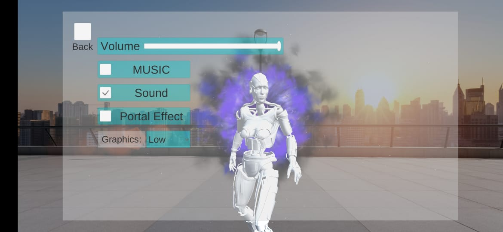
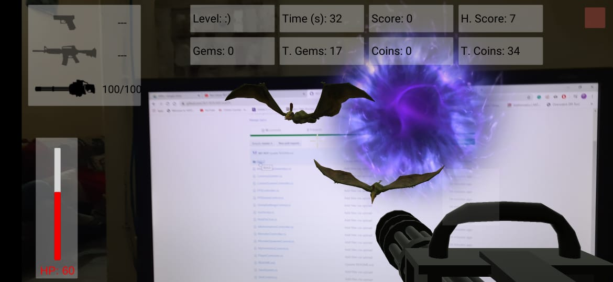
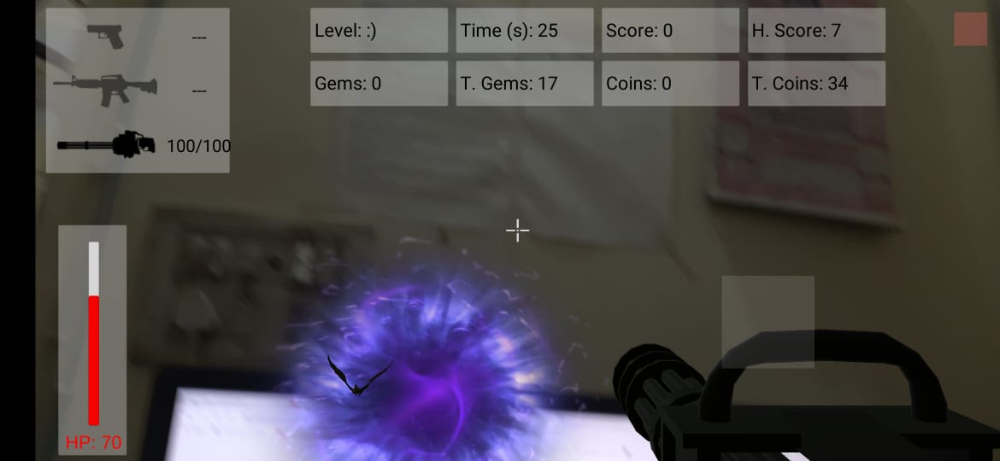

# ARCore FPS
An FPS game set in an AR environment such that players can interact with virtual game objects created with reference to real-world parameters like phone's acceleration, position, rotation to determine it's orientation in virtual 3D space in realtime.

# APK: https://github.com/SKY-ROY/FPS/blob/master/BUILD/ARCoreFPS_9Feb.1.apk

# Screenshots:
Main Menu Screen:
 
Settings Screen:

Inventory Screen:

Gameplay:
 
 
